# 分布式锁

## Redis

### Redis 的 SETNX

Redis 作为一个公共可访问的地方，正好可以作为“占坑”的地方。

用 Redis 实现分布式锁的几种方案，我们都是用 SETNX 命令（设置 key 等于某 value）。只是高阶方案传的参数个数不一样，以及考虑了异常情况。

我们来看下这个命令，`SETNX`是`set If not exist`的简写。意思就是当 key 不存在时，设置 key 的值，存在时，什么都不做。

在 Redis 命令行中是这样执行的：

我们可以进到 redis 容器中来试下 `SETNX` 命令。

先进入容器：

```bash
docker exec -it <容器 id> redid-cli
```

然后执行 SETNX 命令：将 `wukong` 这个 key 对应的 value 设置成 `1111`。

返回 `OK`，表示设置成功。重复执行该命令，返回 `nil`表示设置失败。

```bash
> set key value NX
OK
```

### 青铜方案

先用 Redis 的 SETNX 命令来实现最简单的分布式锁。

#### 原理

我们来看下流程图：


+   多个并发线程都去 Redis 中申请锁，也就是执行 setnx 命令，假设线程 A 执行成功，说明当前线程 A 获得了。
+   其他线程执行 setnx 命令都会是失败的，所以需要等待线程 A 释放锁。
+   线程 A 执行完自己的业务后，删除锁。
+   其他线程继续抢占锁，也就是执行 setnx 命令。因为线程 A 已经删除了锁，所以又有其他线程可以抢占到锁了。

代码示例如下，Java 中 setnx 命令对应的代码为 `setIfAbsent`。

setIfAbsent 方法的第一个参数代表 key，第二个参数代表值。

```java
// 1.先抢占锁
Boolean lock = redisTemplate.opsForValue().setIfAbsent("lock", "123");
if(lock) {
  // 2.抢占成功，执行业务
  List<TypeEntity> typeEntityListFromDb = getDataFromDB();
  // 3.解锁
  redisTemplate.delete("lock");
  return typeEntityListFromDb;
} else {
  // 4.休眠一段时间
  sleep(100);
  // 5.抢占失败，等待锁释放
  return getTypeEntityListByRedisDistributedLock();
}
```

一个小问题：那为什么需要休眠一段时间？

因为该程序存在递归调用，可能会导致栈空间溢出。

#### 缺陷

青铜之所以叫青铜，是因为它是最初级的，肯定会带来很多问题。

**设想一种家庭场景**：晚上小空一个人开锁进入了房间，打开了电灯💡，然后突然`断电`了，小空想开门出去，但是找不到门锁位置，那小明就进不去了，外面的人也进不来。


从技术的角度看：setnx 占锁成功，业务代码出现异常或者服务器宕机，没有执行删除锁的逻辑，就造成了`死锁`。

**那如何规避这个风险呢？**

设置锁的`自动过期时间`，过一段时间后，自动删除锁，这样其他线程就能获取到锁了。

### 白银方案

#### 生活中的例子

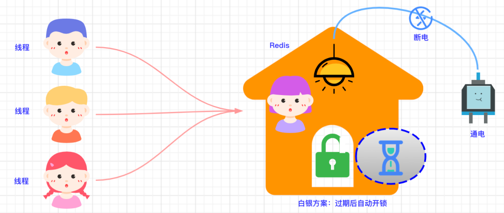

还是生活中的例子：小空开锁成功后，给这款智能锁设置了一个`沙漏倒计时⏳`，沙漏完后，门锁自动打开。即使房间突然断电，过一段时间后，锁会自动打开，其他人就可以进来了。

#### 技术原理图

和青铜方案不同的地方在于，在占锁成功后，设置锁的过期时间，这两步是分步执行的。如下图所示：

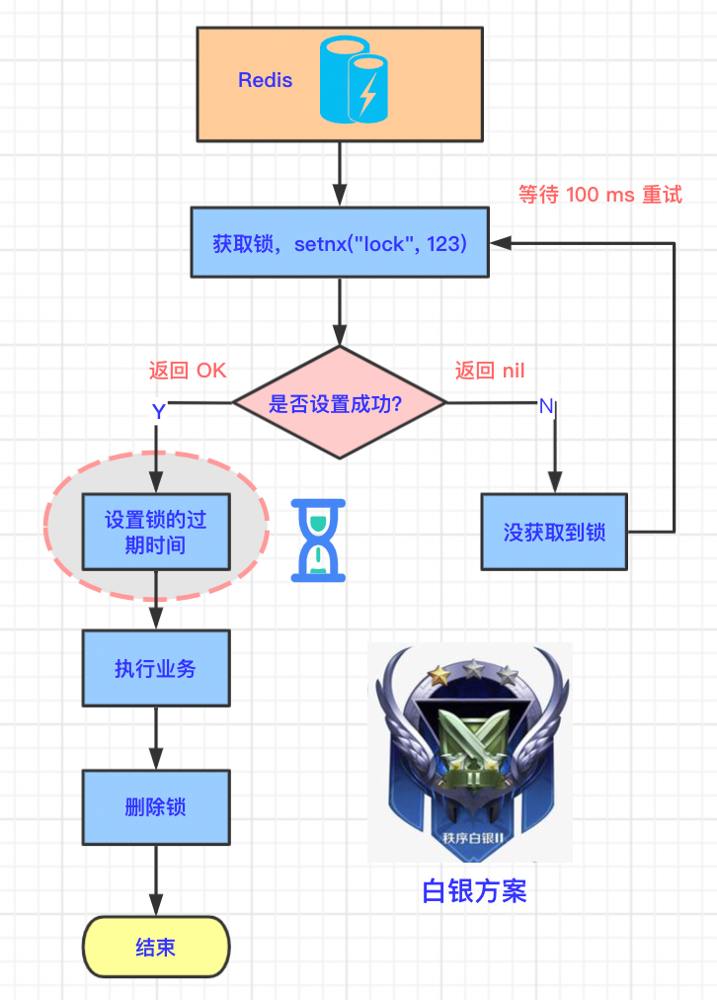

#### 示例代码

清理 redis key 的代码如下

```java
// 在 10s 以后，自动清理 lock
redisTemplate.expire("lock", 10, TimeUnit.SECONDS);
```

完整代码如下：

```java
// 1.先抢占锁
Boolean lock = redisTemplate.opsForValue().setIfAbsent("lock", "123");
if(lock) {
    // 2.在 10s 以后，自动清理 lock
    redisTemplate.expire("lock", 10, TimeUnit.SECONDS);
    // 3.抢占成功，执行业务
    List<TypeEntity> typeEntityListFromDb = getDataFromDB();
    // 4.解锁
    redisTemplate.delete("lock");
    return typeEntityListFromDb;
}
```

#### 缺陷

白银方案看似解决了线程异常或服务器宕机造成的锁未释放的问题，但还是存在其他问题：

因为占锁和设置过期时间是分两步执行的，所以如果在这两步之间发生了异常，则锁的过期时间根本就没有设置成功。

所以和青铜方案有一样的问题：**锁永远不能过期**。

### 黄金方案

#### 原子指令

上面的白银方案中，占锁和设置锁过期时间是分步两步执行的，这个时候，我们可以联想到什么：事务的原子性（Atom）。

**原子性**：多条命令要么都成功执行，要么都不执行。

将两步放在一步中执行：占锁+设置锁过期时间。

Redis 正好支持这种操作：

```bash
# 设置某个 key 的值并设置多少毫秒或秒 过期。
set <key> <value> PX <多少毫秒> NX
或
set <key> <value> EX <多少秒> NX
```

然后可以通过如下命令查看 key 的变化

下面演示下如何设置 key 并设置过期时间。注意：执行命令之前需要先删除 key，可以通过客户端或命令删除。

```java
# 设置 key=k，value=1111，过期时间=5000ms
set k 1111 PX 5000 NX
# 查看 key 的状态
ttl k
```

执行结果如下图所示：每运行一次 `ttl` 命令，就可以看到 `k` 的过期时间就会减少。最后会变为 -2（已过期）。


#### 技术原理图

黄金方案和白银方案的不同之处：获取锁的时候，也需要设置锁的过期时间，这是一个原子操作，要么都成功执行，要么都不执行。如下图所示：

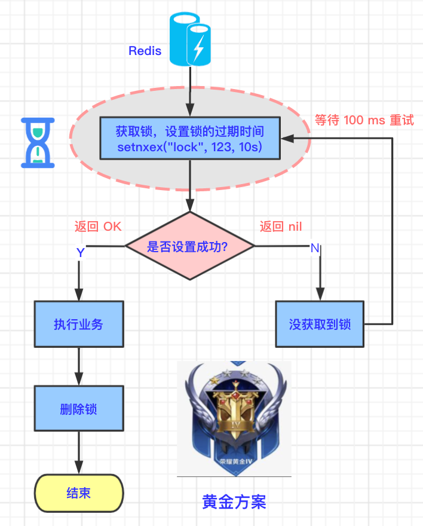

#### 示例代码

设置 `lock` 的值等于 `123`，过期时间为 10 秒。如果 `10` 秒 以后，lock 还存在，则清理 lock。

```java
setIfAbsent("lock", "123", 10, TimeUnit.SECONDS);
```

#### 缺陷

我们还是举生活中的例子来看下黄金方案的缺陷。

1. 用户 A 抢占锁

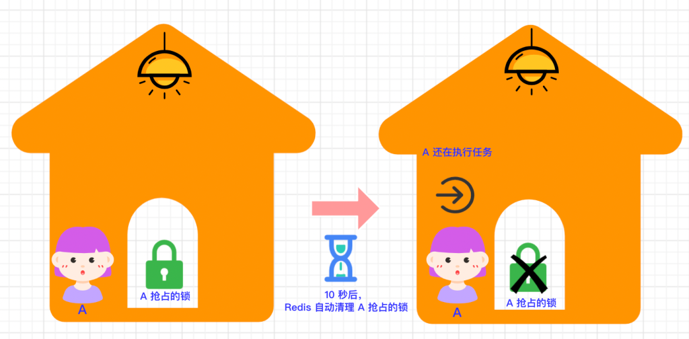

+   用户 A 先抢占到了锁，并设置了这个锁 10 秒以后自动开锁，锁的编号为 `123`。
+   10 秒以后，A 还在执行任务，此时锁被自动打开了。

2. 用户 B 抢占锁


+   用户 B 看到房间的锁打开了，于是抢占到了锁，设置锁的编号为 `123`，并设置了过期时间 `10 秒`。
+   因房间内只允许一个用户执行任务，所以用户 A 和 用户 B 执行任务`产生了冲突`。
+   用户 A 在 `15 s` 后，完成了任务，此时 用户 B 还在执行任务。
+   用户 A 主动打开了编号为 `123`的锁。
+   用户 B 还在执行任务，发现锁已经被打开了。
+   用户 B 非常生气：**我还没执行完任务呢，锁怎么开了？**

3. 用户 C 抢占锁

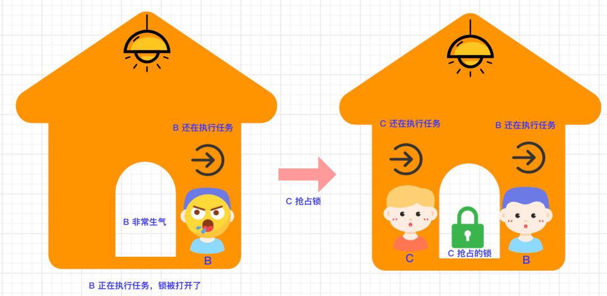

+   用户 B 的锁被 A 主动打开后，A 离开房间，B 还在执行任务。
+   用户 C 抢占到锁，C 开始执行任务。
+   因房间内只允许一个用户执行任务，所以用户 B 和 用户 C 执行任务产生了冲突。

从上面的案例中我们可以知道，因为用户 A 处理任务所需要的时间**大于**锁自动清理（开锁）的时间，所以在自动开锁后，又有其他用户抢占到了锁。当用户 A 完成任务后，会把其他用户抢占到的锁给主动打开。

**这里为什么会打开别人的锁**? 因为锁的编号都叫做 `“123”`，用户 A 只认锁编号，看见编号为 `“123”`的锁就开，结果把用户 B 的锁打开了，此时用户 B 还未执行完任务，当然生气了。

### 铂金方案

#### 生活中的例子

上面的黄金方案的缺陷也很好解决，给每个锁设置**不同的编号**不就好了～

如下图所示，B 抢占的锁是蓝色的，和 A 抢占到绿色锁不一样。这样就不会被 A 打开了。

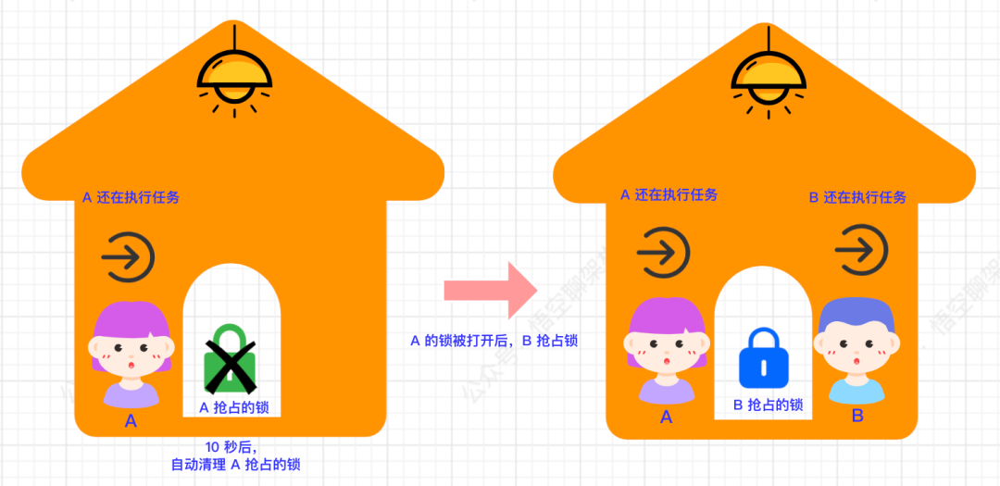

#### 技术原理图

与黄金方案的不同之处：

+   设置锁的过期时间时，还需要设置唯一编号。
+   主动删除锁的时候，需要判断锁的编号是否和设置的一致，如果一致，则认为是自己设置的锁，可以进行主动删除。

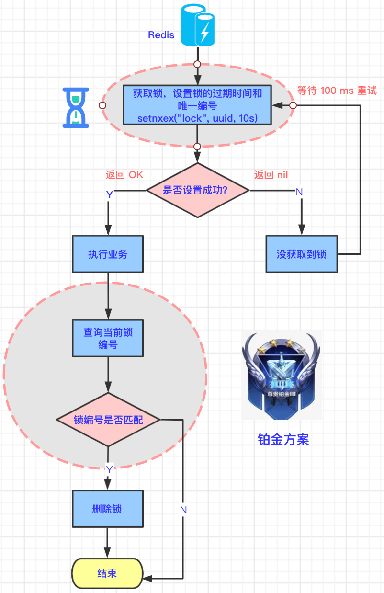

#### 代码示例

```java
// 1.生成唯一 id
String uuid = UUID.randomUUID().toString();
// 2. 抢占锁
Boolean lock = redisTemplate.opsForValue().setIfAbsent("lock", uuid, 10, TimeUnit.SECONDS);
if(lock) {
    System.out.println("抢占成功：" + uuid);
    // 3.抢占成功，执行业务
    List<TypeEntity> typeEntityListFromDb = getDataFromDB();
    // 4.获取当前锁的值
    String lockValue = redisTemplate.opsForValue().get("lock");
    // 5.如果锁的值和设置的值相等，则清理自己的锁
    if(uuid.equals(lockValue)) {
        System.out.println("清理锁：" + lockValue);
        redisTemplate.delete("lock");
    }
    return typeEntityListFromDb;
} else {
    System.out.println("抢占失败，等待锁释放");
    // 4.休眠一段时间
    sleep(100);
    // 5.抢占失败，等待锁释放
    return getTypeEntityListByRedisDistributedLock();
}
```

+   1.生成随机唯一 id，给锁加上唯一值。
+   2.抢占锁，并设置过期时间为 10 s，且锁具有随机唯一 id。
+   3.抢占成功，执行业务。
+   4.执行完业务后，获取当前锁的值。
+   5.如果锁的值和设置的值相等，则清理自己的锁。

#### 铂金方案的缺陷

上面的方案看似很完美，但还是存在问题：第 4 步和第 5 步并不是原子性的。


+   时刻：0s。线程 A 抢占到了锁。
+   时刻：9.5s。线程 A 向 Redis 查询当前 key 的值。
+   时刻：10s。锁自动过期。
+   时刻：11s。线程 B 抢占到锁。
+   时刻：12s。线程 A 在查询途中耗时长，终于拿多锁的值。
+   时刻：13s。线程 A 还是拿自己设置的锁的值和返回的值进行比较，值是相等的，清理锁，但是这个锁其实是线程 B 抢占的锁。

那如何规避这个风险呢？钻石方案登场。

### 钻石方案

上面的线程 A 查询锁和删除锁的逻辑不是`原子性`的，所以将查询锁和删除锁这两步作为原子指令操作就可以了。

#### 技术原理图

如下图所示，红色圈出来的部分是钻石方案的不同之处。用脚本进行删除，达到原子操作。


#### 代码示例

那如何用脚本进行删除呢？

我们先来看一下这段 Redis 专属脚本：

```java
if redis.call("get",KEYS[1]) == ARGV[1]
then
    return redis.call("del",KEYS[1])
else
    return 0
end
```

这段脚本和铂金方案的获取key，删除key的方式很像。先获取 KEYS\[1\] 的 value，判断 KEYS\[1\] 的 value 是否和 ARGV\[1\] 的值相等，如果相等，则删除 KEYS\[1\]。

那么这段脚本怎么在 Java 项目中执行呢？

分两步：先定义脚本；用 redisTemplate.execute 方法执行脚本。

```java
// 脚本解锁
String script = "if redis.call('get',KEYS[1]) == ARGV[1] then return redis.call('del',KEYS[1]) else return 0 end";
redisTemplate.execute(new DefaultRedisScript<Long>(script, Long.class), Arrays.asList("lock"), uuid);
```

上面的代码中，KEYS\[1\] 对应`“lock”`，ARGV\[1\] 对应 `“uuid”`，含义就是如果 lock 的 value 等于 uuid 则删除 lock。

而这段 Redis 脚本是由 Redis 内嵌的 Lua 环境执行的，所以又称作 Lua 脚本。

**那钻石方案是不是就完美了呢？有没有更好的方案呢？**

下篇，我们再来介绍另外一种分布式锁的王者方案：Redisson。

## Redisson

### 整合 Redisson

1. 引入 Maven 依赖

pom.xml 引入 redisson的 maven 依赖。

```xml
<!-- https://mvnrepository.com/artifact/org.redisson/redisson -->
<dependency>
    <groupId>org.redisson</groupId>
    <artifactId>redisson</artifactId>
    <version>3.15.5</version>
</dependency>
```

2. 自定义配置类

下面的代码是单节点 Redis 的配置。

```java
@Configuration
public class MyRedissonConfig {
    /**
     * 对 Redisson 的使用都是通过 RedissonClient 对象
     * @return
     * @throws IOException
     */
    @Bean(destroyMethod="shutdown") // 服务停止后调用 shutdown 方法。
    public RedissonClient redisson() throws IOException {
        // 1.创建配置
        Config config = new Config();
        // 集群模式
        // config.useClusterServers().addNodeAddress("127.0.0.1:7004", "127.0.0.1:7001");
        // 2.根据 Config 创建出 RedissonClient 示例。
        config.useSingleServer().setAddress("redis://127.0.0.1:6379");
        return Redisson.create(config);
    }
}
```

### 分布式可重入锁

#### 可重入锁测试

基于Redis的Redisson分布式可重入锁`RLock`Java 对象实现了`java.util.concurrent.locks.Lock`接口。同时还提供了异步（Async）、反射式（Reactive）和RxJava2标准的接口。

```java
RLock lock = redisson.getLock("anyLock");
// 最常见的使用方法
lock.lock();
```

测试下可重入锁的两个点：

+   多个线程抢占锁，后面锁需要等待吗？
+   如果抢占到锁的线程所在的服务停了，锁会不会被释放？

1. 验证一：可重入锁是阻塞的吗

为了验证以上两点，我写了个 demo 程序：代码的流程就是设置`WuKong-lock`锁，然后加锁，打印线程 ID，等待 10 秒后释放锁，最后返回响应：“test lock ok”。

```java
@ResponseBody
@GetMapping("test-lock")
public String TestLock() {
    // 1.获取锁，只要锁的名字一样，获取到的锁就是同一把锁。
    RLock lock = redisson.getLock("WuKong-lock");

    // 2.加锁
    lock.lock();
    try {
        System.out.println("加锁成功，执行后续代码。线程 ID：" + Thread.currentThread().getId());
        Thread.sleep(10000);
    } catch (Exception e) {
        //TODO
    } finally {
        lock.unlock();
        // 3.解锁
        System.out.println("Finally，释放锁成功。线程 ID：" + Thread.currentThread().getId());
    }

    return "test lock ok";
}
```

先验证第一个点，用两个 http 请求来测试抢占锁。

请求的 URL：

```curl
http://localhost:11000/question/v1/redisson/test/test-lock
```

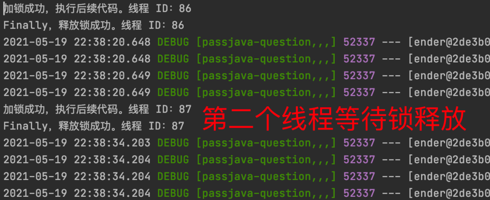

第一个线程对应的线程 ID 为 86，10秒后，释放锁。在这期间，第二个线程需要等待锁释放。

第一个线程释放锁之后，第二个线程获取到了锁，10 秒后，释放锁。


+   第一步：线程 A 在 0 秒时，抢占到锁，0.1 秒后，开始执行等待 10 s。
+   第二步：线程 B 在 0.1 秒尝试抢占锁，未能抢到锁（被 A 抢占了）。
+   第三步：线程 A 在 10.1 秒后，释放锁。
+   第四步：线程 B 在 10.1 秒后抢占到锁，然后等待 10 秒后释放锁。

由此可以得出结论，Redisson 的可重入锁（lock）是阻塞其他线程的，需要等待其他线程释放的。

2. 验证二：服务停了，锁会释放吗？

如果线程 A 在等待的过程中，服务突然停了，那么锁会释放吗？如果不释放的话，就会成为死锁，阻塞了其他线程获取锁。

WuKong-lock 有值，而且大家可以看到 TTL 在不断变小，说明 WuKong-lock 是自带过期时间的。

通过观察，经过 30 秒后，WuKong-lock 过期消失了。说明 Redisson 在停机后，占用的锁会自动释放。

那这又是什么原理呢？这里就要提一个概念了，`看门狗`。

#### 看门狗原理

如果负责储存这个分布式锁的 Redisson 节点宕机以后，而且这个锁正好处于锁住的状态时，这个锁会出现锁死的状态。为了避免这种情况的发生，Redisson内部提供了一个监控锁的`看门狗`，它的作用是在Redisson实例被关闭前，不断的延长锁的有效期。

默认情况下，看门狗的检查锁的超时时间是30秒钟，也可以通过修改Config.lockWatchdogTimeout来另行指定。

如果我们未制定 lock 的超时时间，就使用 30 秒作为看门狗的默认时间。只要占锁成功，就会启动一个`定时任务`：每隔 10 秒重新给锁设置过期的时间，过期时间为 30 秒。


当服务器宕机后，因为锁的有效期是 30 秒，所以会在 30 秒内自动解锁。（30秒等于宕机之前的锁占用时间+后续锁占用的时间）。

如下图所示：


#### 设置锁过期时间

我们也可以通过给锁设置过期时间，让其自动解锁。

如下所示，设置锁 8 秒后自动过期。

```java
lock.lock(8, TimeUnit.SECONDS);
```

如果业务执行时间超过 8 秒，手动释放锁将会报错：


所以我们如果设置了锁的自动过期时间，则执行业务的时间一定要小于锁的自动过期时间，否则就会报错。

### 王者方案

原理图如下：

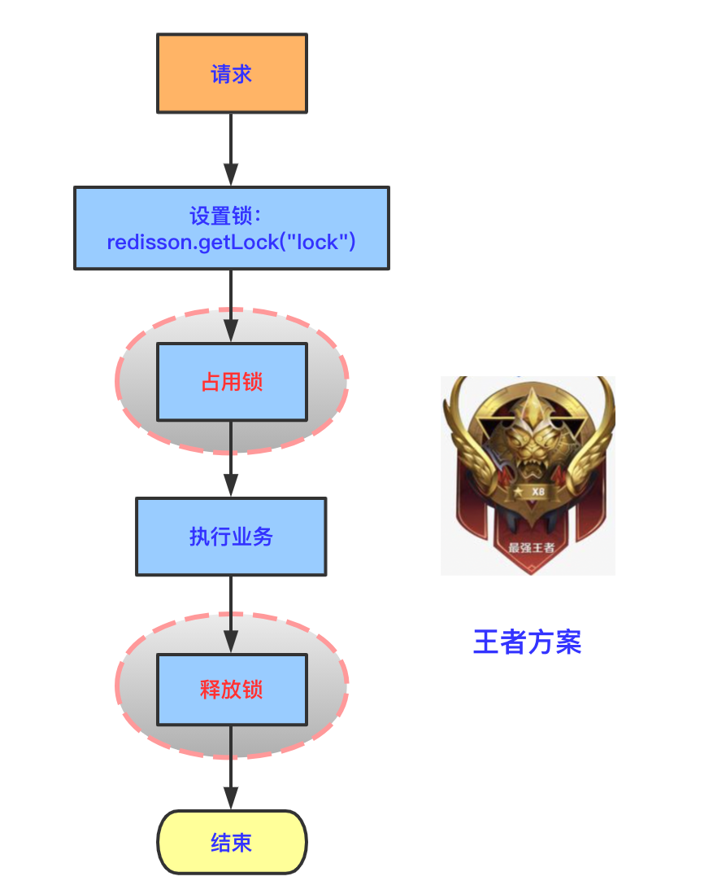

```java
// 1.设置分布式锁
RLock lock = redisson.getLock("lock");
// 2.占用锁
lock.lock();
// 3.执行业务
...
// 4.释放锁
lock.unlock();
```

和之前 Redis 的方案相比，简洁很多。

下面讲解下 Redisson 的其他几种分布式锁，相信大家在以后的项目中也会用到。

### 分布式读写锁

基于 Redis 的 Redisson 分布式可重入读写锁`RReadWriteLock` Java对象实现了`java.util.concurrent.locks.ReadWriteLock`接口。其中读锁和写锁都继承了 `RLock`接口。

写锁是一个排他锁（互斥锁），读锁是一个共享锁。

+   读锁 + 读锁：相当于没加锁，可以并发读。
+   读锁 + 写锁：写锁需要等待读锁释放锁。
+   写锁 + 写锁：互斥，需要等待对方的锁释放。
+   写锁 + 读锁：读锁需要等待写锁释放。

```java
RReadWriteLock rwlock = redisson.getReadWriteLock("anyRWLock");
// 最常见的使用方法
rwlock.readLock().lock();
// 或
rwlock.writeLock().lock();
```

另外Redisson还通过加锁的方法提供了`leaseTime`的参数来指定加锁的时间。超过这个时间后锁便自动解开了。

```java
// 10秒钟以后自动解锁
// 无需调用unlock方法手动解锁
rwlock.readLock().lock(10, TimeUnit.SECONDS);
// 或
rwlock.writeLock().lock(10, TimeUnit.SECONDS);

// 尝试加锁，最多等待100秒，上锁以后10秒自动解锁
boolean res = rwlock.readLock().tryLock(100, 10, TimeUnit.SECONDS);
// 或
boolean res = rwlock.writeLock().tryLock(100, 10, TimeUnit.SECONDS);
...
lock.unlock();
```

### 分布式信号量

基于Redis的Redisson的分布式信号量（Semaphore）Java对象`RSemaphore`采用了与`java.util.concurrent.Semaphore`相似的接口和用法。同时还提供了异步（Async）、反射式（Reactive）和RxJava2标准的接口。

关于信号量的使用大家可以想象一下这个场景，有三个停车位，当三个停车位满了后，其他车就不停了。可以把车位比作信号，现在有三个信号，停一次车，用掉一个信号，车离开就是释放一个信号。

先定义一个占用停车位的方法：

```java
/**
* 停车，占用停车位
* 总共 3 个车位
*/
@ResponseBody
@RequestMapping("park")
public String park() throws InterruptedException {
  // 获取信号量（停车场）
  RSemaphore park = redisson.getSemaphore("park");
  // 获取一个信号（停车位）
  park.acquire();

  return "OK";
}
```

再定义一个离开车位的方法：

```java
/**
 * 释放车位
 * 总共 3 个车位
 */
@ResponseBody
@RequestMapping("leave")
public String leave() throws InterruptedException {
    // 获取信号量（停车场）
    RSemaphore park = redisson.getSemaphore("park");
    // 释放一个信号（停车位）
    park.release();

    return "OK";
}
```

为了简便，我用 Redis 客户端添加了一个 key：“park”，值等于 3，代表信号量为 park，总共有三个值。

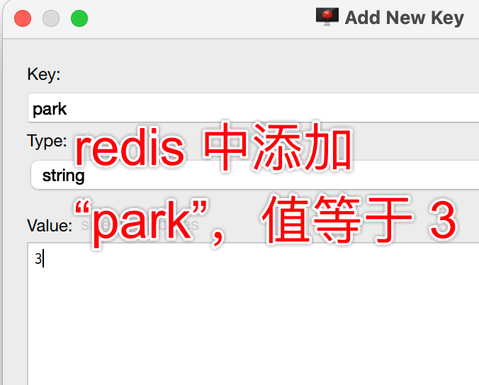

然后用 postman 发送 park 请求占用一个停车位。

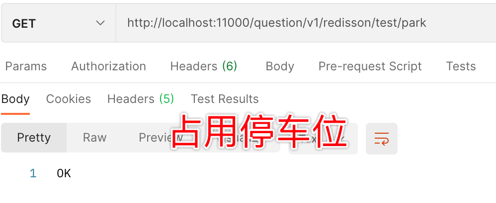

然后在 redis 客户端查看 park 的值，发现已经改为 2 了。继续调用两次，发现 park 的等于 0，当调用第四次的时候，会发现请求一直处于`等待中`，说明车位不够了。如果想要不阻塞，可以用 tryAcquire 或 tryAcquireAsync。

我们再调用离开车位的方法，park 的值变为了 1，代表车位剩余 1 个。

**注意**：多次执行释放信号量操作，剩余信号量会一直增加，而不是到 3 后就封顶了。

其他分布式锁：

+   公平锁（Fair Lock）
+   联锁（MultiLock）
+   红锁（RedLock）
+   读写锁（ReadWriteLock）
+   可过期性信号量（PermitExpirableSemaphore）
+   闭锁（CountDownLatch）
