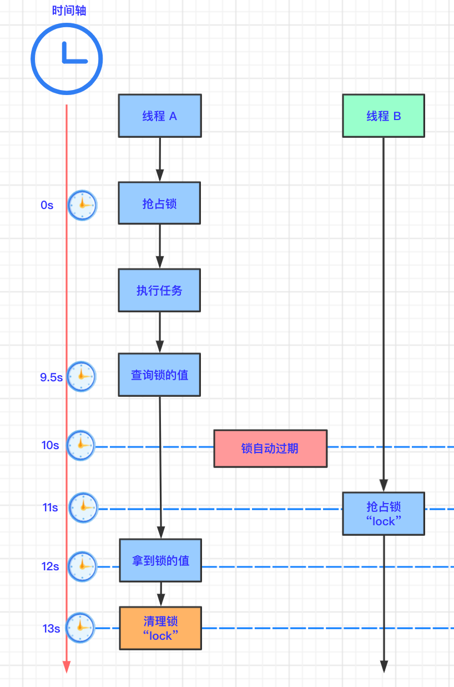
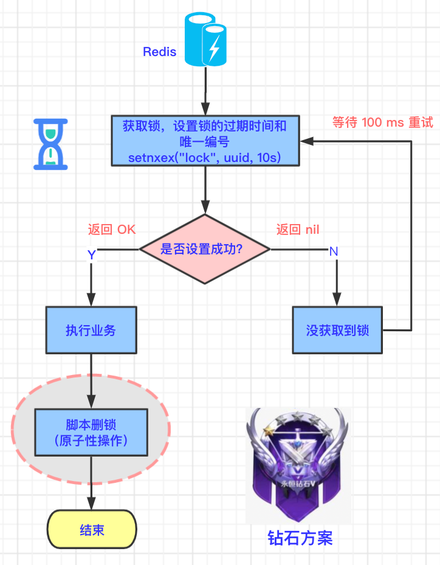

# Redis

## Redis 的 SETNX

Redis 作为一个公共可访问的地方，正好可以作为“占坑”的地方。

用 Redis 实现分布式锁的几种方案，我们都是用 SETNX 命令（设置 key 等于某 value）。只是高阶方案传的参数个数不一样，以及考虑了异常情况。

我们来看下这个命令，`SETNX`是`set If not exist`的简写。意思就是当 key 不存在时，设置 key 的值，存在时，什么都不做。

在 Redis 命令行中是这样执行的：

我们可以进到 redis 容器中来试下 `SETNX` 命令。

先进入容器：

```bash
docker exec -it <容器 id> redid-cli
```

然后执行 SETNX 命令：将 `wukong` 这个 key 对应的 value 设置成 `1111`。

返回 `OK`，表示设置成功。重复执行该命令，返回 `nil`表示设置失败。

```bash
> set key value NX
OK
```

## 青铜方案

先用 Redis 的 SETNX 命令来实现最简单的分布式锁。

### 原理

我们来看下流程图：


+   多个并发线程都去 Redis 中申请锁，也就是执行 setnx 命令，假设线程 A 执行成功，说明当前线程 A 获得了。
+   其他线程执行 setnx 命令都会是失败的，所以需要等待线程 A 释放锁。
+   线程 A 执行完自己的业务后，删除锁。
+   其他线程继续抢占锁，也就是执行 setnx 命令。因为线程 A 已经删除了锁，所以又有其他线程可以抢占到锁了。

代码示例如下，Java 中 setnx 命令对应的代码为 `setIfAbsent`。

setIfAbsent 方法的第一个参数代表 key，第二个参数代表值。

```java
// 1.先抢占锁
Boolean lock = redisTemplate.opsForValue().setIfAbsent("lock", "123");
if(lock) {
  // 2.抢占成功，执行业务
  List<TypeEntity> typeEntityListFromDb = getDataFromDB();
  // 3.解锁
  redisTemplate.delete("lock");
  return typeEntityListFromDb;
} else {
  // 4.休眠一段时间
  sleep(100);
  // 5.抢占失败，等待锁释放
  return getTypeEntityListByRedisDistributedLock();
}
```

一个小问题：那为什么需要休眠一段时间？

因为该程序存在递归调用，可能会导致栈空间溢出。

### 缺陷

青铜之所以叫青铜，是因为它是最初级的，肯定会带来很多问题。

**设想一种家庭场景**：晚上小空一个人开锁进入了房间，打开了电灯💡，然后突然`断电`了，小空想开门出去，但是找不到门锁位置，那小明就进不去了，外面的人也进不来。


从技术的角度看：setnx 占锁成功，业务代码出现异常或者服务器宕机，没有执行删除锁的逻辑，就造成了`死锁`。

**那如何规避这个风险呢？**

设置锁的`自动过期时间`，过一段时间后，自动删除锁，这样其他线程就能获取到锁了。

## 白银方案

### 生活中的例子


还是生活中的例子：小空开锁成功后，给这款智能锁设置了一个`沙漏倒计时⏳`，沙漏完后，门锁自动打开。即使房间突然断电，过一段时间后，锁会自动打开，其他人就可以进来了。

### 技术原理图

和青铜方案不同的地方在于，在占锁成功后，设置锁的过期时间，这两步是分步执行的。如下图所示：


### 示例代码

清理 redis key 的代码如下

```java
// 在 10s 以后，自动清理 lock
redisTemplate.expire("lock", 10, TimeUnit.SECONDS);
```

完整代码如下：

```java
// 1.先抢占锁
Boolean lock = redisTemplate.opsForValue().setIfAbsent("lock", "123");
if(lock) {
    // 2.在 10s 以后，自动清理 lock
    redisTemplate.expire("lock", 10, TimeUnit.SECONDS);
    // 3.抢占成功，执行业务
    List<TypeEntity> typeEntityListFromDb = getDataFromDB();
    // 4.解锁
    redisTemplate.delete("lock");
    return typeEntityListFromDb;
}
```

### 缺陷

白银方案看似解决了线程异常或服务器宕机造成的锁未释放的问题，但还是存在其他问题：

因为占锁和设置过期时间是分两步执行的，所以如果在这两步之间发生了异常，则锁的过期时间根本就没有设置成功。

所以和青铜方案有一样的问题：**锁永远不能过期**。

## 黄金方案

### 原子指令

上面的白银方案中，占锁和设置锁过期时间是分步两步执行的，这个时候，我们可以联想到什么：事务的原子性（Atom）。

**原子性**：多条命令要么都成功执行，要么都不执行。

将两步放在一步中执行：占锁+设置锁过期时间。

Redis 正好支持这种操作：

```bash
# 设置某个 key 的值并设置多少毫秒或秒 过期。
set <key> <value> PX <多少毫秒> NX
或
set <key> <value> EX <多少秒> NX
```

然后可以通过如下命令查看 key 的变化

下面演示下如何设置 key 并设置过期时间。注意：执行命令之前需要先删除 key，可以通过客户端或命令删除。

```javascript
# 设置 key=k，value=1111，过期时间=5000ms
set k 1111 PX 5000 NX
# 查看 key 的状态
ttl k
```

执行结果如下图所示：每运行一次 `ttl` 命令，就可以看到 `k` 的过期时间就会减少。最后会变为 -2（已过期）。


### 技术原理图

黄金方案和白银方案的不同之处：获取锁的时候，也需要设置锁的过期时间，这是一个原子操作，要么都成功执行，要么都不执行。如下图所示：


### 示例代码

设置 `lock` 的值等于 `123`，过期时间为 10 秒。如果 `10` 秒 以后，lock 还存在，则清理 lock。

```java
setIfAbsent("lock", "123", 10, TimeUnit.SECONDS);
```

### 缺陷

我们还是举生活中的例子来看下黄金方案的缺陷。

1. 用户 A 抢占锁


+   用户 A 先抢占到了锁，并设置了这个锁 10 秒以后自动开锁，锁的编号为 `123`。
+   10 秒以后，A 还在执行任务，此时锁被自动打开了。

2. 用户 B 抢占锁


+   用户 B 看到房间的锁打开了，于是抢占到了锁，设置锁的编号为 `123`，并设置了过期时间 `10 秒`。
+   因房间内只允许一个用户执行任务，所以用户 A 和 用户 B 执行任务`产生了冲突`。
+   用户 A 在 `15 s` 后，完成了任务，此时 用户 B 还在执行任务。
+   用户 A 主动打开了编号为 `123`的锁。
+   用户 B 还在执行任务，发现锁已经被打开了。
+   用户 B 非常生气：**我还没执行完任务呢，锁怎么开了？**

3. 用户 C 抢占锁


+   用户 B 的锁被 A 主动打开后，A 离开房间，B 还在执行任务。
+   用户 C 抢占到锁，C 开始执行任务。
+   因房间内只允许一个用户执行任务，所以用户 B 和 用户 C 执行任务产生了冲突。

从上面的案例中我们可以知道，因为用户 A 处理任务所需要的时间**大于**锁自动清理（开锁）的时间，所以在自动开锁后，又有其他用户抢占到了锁。当用户 A 完成任务后，会把其他用户抢占到的锁给主动打开。

**这里为什么会打开别人的锁**?因为锁的编号都叫做 `“123”`，用户 A 只认锁编号，看见编号为 `“123”`的锁就开，结果把用户 B 的锁打开了，此时用户 B 还未执行完任务，当然生气了。

## 铂金方案

#### **6.1 生活中的例子**

上面的黄金方案的缺陷也很好解决，给每个锁设置**不同的编号**不就好了～

如下图所示，B 抢占的锁是蓝色的，和 A 抢占到绿色锁不一样。这样就不会被 A 打开了。


### 技术原理图

与黄金方案的不同之处：

+   设置锁的过期时间时，还需要设置唯一编号。
+   主动删除锁的时候，需要判断锁的编号是否和设置的一致，如果一致，则认为是自己设置的锁，可以进行主动删除。


#### **6.3 代码示例**

```java
// 1.生成唯一 id
String uuid = UUID.randomUUID().toString();
// 2. 抢占锁
Boolean lock = redisTemplate.opsForValue().setIfAbsent("lock", uuid, 10, TimeUnit.SECONDS);
if(lock) {
    System.out.println("抢占成功：" + uuid);
    // 3.抢占成功，执行业务
    List<TypeEntity> typeEntityListFromDb = getDataFromDB();
    // 4.获取当前锁的值
    String lockValue = redisTemplate.opsForValue().get("lock");
    // 5.如果锁的值和设置的值相等，则清理自己的锁
    if(uuid.equals(lockValue)) {
        System.out.println("清理锁：" + lockValue);
        redisTemplate.delete("lock");
    }
    return typeEntityListFromDb;
} else {
    System.out.println("抢占失败，等待锁释放");
    // 4.休眠一段时间
    sleep(100);
    // 5.抢占失败，等待锁释放
    return getTypeEntityListByRedisDistributedLock();
}
```

+   1.生成随机唯一 id，给锁加上唯一值。
+   2.抢占锁，并设置过期时间为 10 s，且锁具有随机唯一 id。
+   3.抢占成功，执行业务。
+   4.执行完业务后，获取当前锁的值。
+   5.如果锁的值和设置的值相等，则清理自己的锁。

#### **6.4 铂金方案的缺陷**

上面的方案看似很完美，但还是存在问题：第 4 步和第 5 步并不是原子性的。



+   时刻：0s。线程 A 抢占到了锁。
+   时刻：9.5s。线程 A 向 Redis 查询当前 key 的值。
+   时刻：10s。锁自动过期。
+   时刻：11s。线程 B 抢占到锁。
+   时刻：12s。线程 A 在查询途中耗时长，终于拿多锁的值。
+   时刻：13s。线程 A 还是拿自己设置的锁的值和返回的值进行比较，值是相等的，清理锁，但是这个锁其实是线程 B 抢占的锁。

那如何规避这个风险呢？钻石方案登场。

## 钻石方案

上面的线程 A 查询锁和删除锁的逻辑不是`原子性`的，所以将查询锁和删除锁这两步作为原子指令操作就可以了。

### 技术原理图

如下图所示，红色圈出来的部分是钻石方案的不同之处。用脚本进行删除，达到原子操作。



### 代码示例

那如何用脚本进行删除呢？

我们先来看一下这段 Redis 专属脚本：

```java
if redis.call("get",KEYS[1]) == ARGV[1]
then
    return redis.call("del",KEYS[1])
else
    return 0
end
```

这段脚本和铂金方案的获取key，删除key的方式很像。先获取 KEYS\[1\] 的 value，判断 KEYS\[1\] 的 value 是否和 ARGV\[1\] 的值相等，如果相等，则删除 KEYS\[1\]。

那么这段脚本怎么在 Java 项目中执行呢？

分两步：先定义脚本；用 redisTemplate.execute 方法执行脚本。

```java
// 脚本解锁
String script = "if redis.call('get',KEYS[1]) == ARGV[1] then return redis.call('del',KEYS[1]) else return 0 end";
redisTemplate.execute(new DefaultRedisScript<Long>(script, Long.class), Arrays.asList("lock"), uuid);
```

上面的代码中，KEYS\[1\] 对应`“lock”`，ARGV\[1\] 对应 `“uuid”`，含义就是如果 lock 的 value 等于 uuid 则删除 lock。

而这段 Redis 脚本是由 Redis 内嵌的 Lua 环境执行的，所以又称作 Lua 脚本。

**那钻石方案是不是就完美了呢？有没有更好的方案呢？**

下篇，我们再来介绍另外一种分布式锁的王者方案：Redisson。
